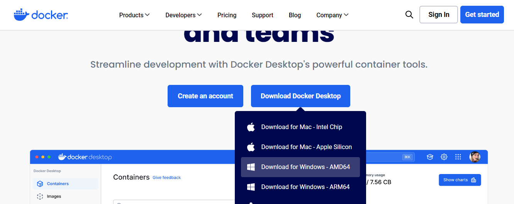
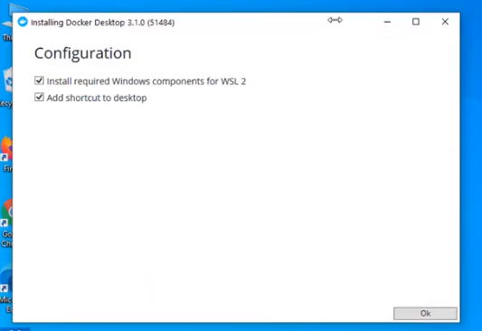
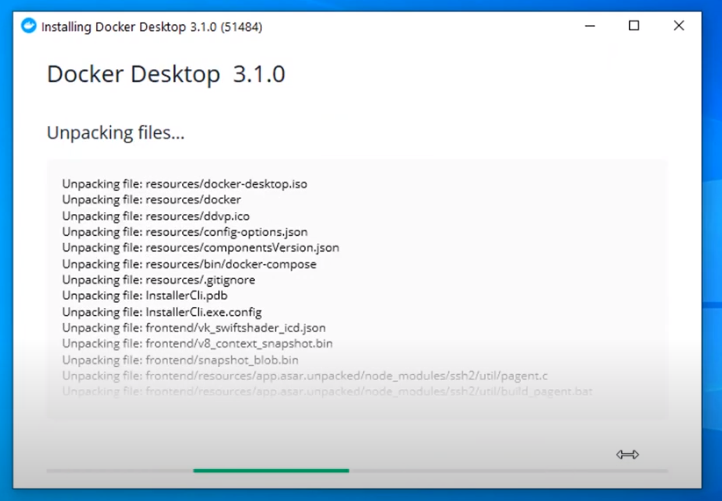
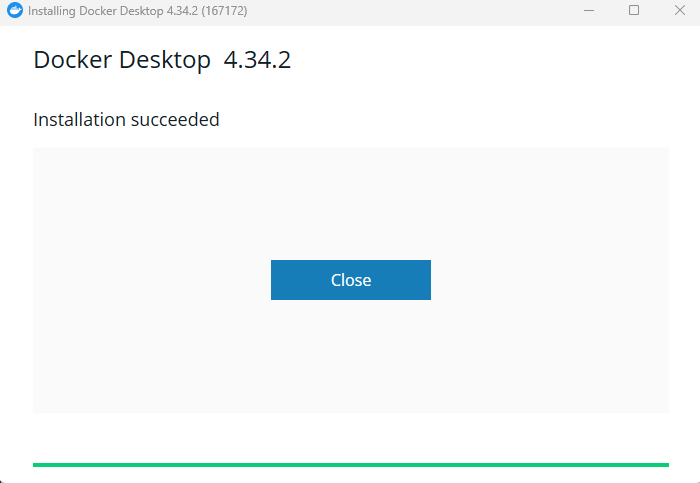

# **Docker Desktop Installation and Setup Guide for Windows**

## **Table of Contents**

---

* [**Description**](#description)
* [**Problem Statement**](#problem-statement)
* [**Prerequisites**](#prerequisites)
  - [**Software Requirement**](#software-requirement)
  - [**Hardware Requirement**](#hardware-requirement)
* [**Installation Steps**](#installation-steps)
  - [**Step-1: Install Docker Desktop on Windows**](#step-1-install-docker-desktop-on-windows)
  - [**Step-2: Verify Docker Installation**](#step-2-verify-docker-installation)
* [**References**](#references)

## **Description**

---

Docker is an open platform for developing, shipping, and running applications. Docker enables you to separate your applications from your infrastructure so you can deliver software quickly. With Docker, you can manage your infrastructure in the same ways you manage your applications. By taking advantage of Docker's methodologies for shipping, testing, and deploying code, you can significantly reduce the delay between writing code and running it in production.

This document focuses on installing Docker Desktop on Windows and verifying that the installation is successful. By following this guide, users can run Docker containers in a Windows environment using Linux or Windows containers with minimal configuration.


## **Problem Statement**
---
Developers working in diverse environments often need to ensure consistent environments across teams and systems. Docker allows applications to be packaged with their dependencies and run across any system where Docker is installed. On Windows, setting up Docker Desktop involves configuring both Docker and Windows Subsystem for Linux (WSL) to provide optimal performance and compatibility.

This guide addresses the following problems:
* Installing Docker Desktop on Windows.
* Ensuring that Docker is properly configured with WSL 2.
* Verifying that Docker is running correctly on the system.

## **Prerequisites**
---
### **Software Requirement**

Before beginning the installation, ensure the following software is available and compatible:

1. **Docker Desktop**: Download from [Docker Desktop for Windows](#1-download-docker-desktop).

2. **Windows 10 (64-bit) or higher**: Required for WSL 2 integration.

3. **Windows Subsystem for Linux 2 (WSL 2)**: This enables Linux container support on Windows systems.

4. **Python (Optional)**: If working with Python-based applications within Docker, install Python.

Docker Desktop can run either Windows containers or Linux containers; Linux containers are the default and require WSL 2 for optimal performance on Windows systems.

### **Hardware Requirement**
Ensure your system meets the following hardware specifications to run Docker Desktop efficiently:

* **CPU**: 64-bit processor with virtualization support (Intel VT-x/AMD-V).
* **RAM**: 4 GB RAM (8 GB or higher recommended).
* **Storage**: 10 GB free disk space for Docker images and containers.
* **Virtualization**: Ensure that hardware virtualization is enabled in BIOS. This is critical for Docker to function.

## **Installation Steps**
---
### **Step-1: Install Docker Desktop on Windows**

#### 1. **Download Docker Desktop**:
   - Visit [https://www.docker.com/products/docker-desktop](https://www.docker.com/products/docker-desktop) and download the Windows version of Docker Desktop 4.34.2.
   - Click on **Download for Windows-AMD64**.
   

#### 2. **Run the Installer**:
   - After the download is complete, run the installer (`Docker Desktop Installer.exe`).
   - Follow the installation prompts. Make sure **Install required components for WSL 2** is selected.

  

  

  

#### 3. **Restart the System**:
   - Once installation is complete, restart your system.

#### 4. **Initial Docker Desktop Setup**:
   - Launch Docker Desktop after restart.

### **Step-2: Verify Docker Installation**

#### 1. **Check Docker Version**:
   Open **Command Prompt** or **Windows PowerShell** and run the following command to confirm Docker is installed:

   ```bash
   docker --version
   ```

   

## **References**
---
For more detailed information, consult the following references:
- Docker Official Documentation: [click here](https://docs.docker.com/desktop/install/windows-install/)
