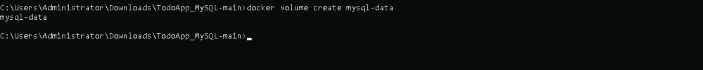
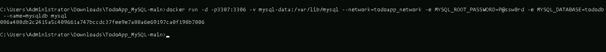
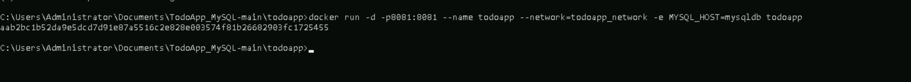
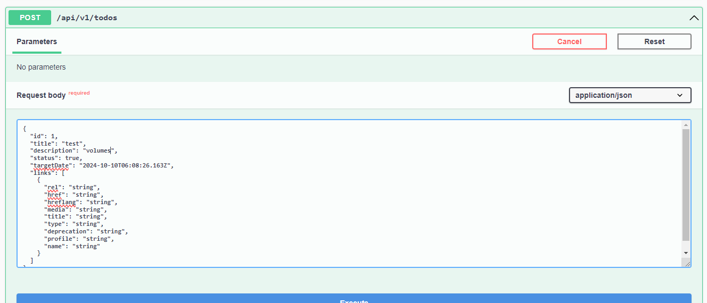
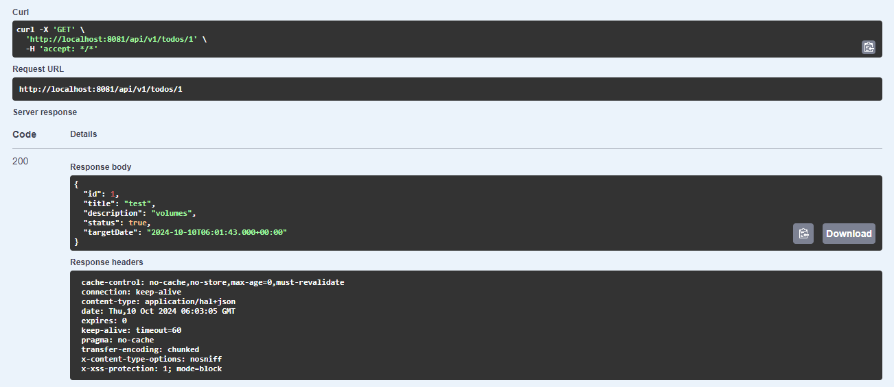
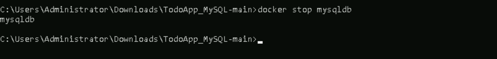
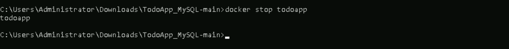
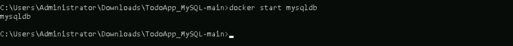
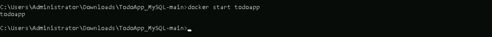

# **Persist Data Across Container Restarts Using Docker Volumes**

## **Table of Contents**
---
* [**Description**](#description)  
* [**Problem Statement**](#problem-statement)  
* [**Prerequisites**](#prerequisites)
  - [**Software Requirement**](#software-requirement)  
  - [**Hardware Requirement**](#hardware-requirement)  
* [**Implementation Steps**](#implementation-steps) 
- [**Step-1: Create a Docker Volume**](#step-1-create-a-docker-volume)  
  - [**Step-2: Run MySQL Container with Volume**](#step-2-run-mysql-container-with-volume)  
  - [**Step-3: Run the TodoApp Container**](#step-3-run-the-todoapp-container)
  - [**Step-4: Test Data Persistence**](#step-4-test-data-persistence) 
* [**References**](#references)

## **Description**
---
This section outlines how to use Docker volumes to persist data in your TodoApp across container restarts. Volumes provide a way to store data independently from the container's lifecycle, ensuring that data remains intact even if the container is stopped or removed.

## **Problem Statement**
---
By default, any data stored inside a Docker container is ephemeral and will be lost when the container is removed. To ensure that user data (e.g., tasks, user information) persists between container restarts or re-creations, we will use Docker volumes.

## **Prerequisites**
---
Completion of all previous lab guides (up to Lab Guide-04) is required before proceeding with Lab Guide-05.

### **Software Requirement**

- **Docker Desktop**: Installed and running on your Windows system.
- **Java JDK 11 or higher**: For building the Java-based TodoApp.
- **MySQL Docker Image**: Official MySQL image pulled from Docker Hub.
- **TodoApp Docker Image**: Make sure `Docker image` is present for todoapp.
- **TodoAPP_MYSQl**: To download the source folder [**click here**](https://github.com/SwayaanTechnologies/TodoApp_MySQL/archive/refs/heads/main.zip)


### **Hardware Requirement**

- **CPU**: 64-bit processor with virtualization support.
- **RAM**: 4 GB minimum (8 GB recommended).
- **Disk Space**: 1 GB or more for Docker images and containers.


## **Implementation Steps**
---

### **Step-1: Create a Docker Volume**
First, we need to create a Docker volume that will hold the data for our MySQL database.

```bash
   docker volume create mysql-data
```



### **Step-2: Run MySQL Container with Volume**
Next, we will run the MySQL container using the volume we created. This will ensure that the database data is persisted.

  ```bash
  docker run -d -p3307:3306 -v mysql-data:/var/lib/mysql --network=todoapp_network -e MYSQL_ROOT_PASSWORD=P@ssw0rd -e MYSQL_DATABASE=tododb --name=mysqldb mysql
  ```


  - **-v todoapp_data:/var/lib/mysql**: This flag mounts the **todoapp_data** volume to the **/var/lib/mysql** directory in the MySQL container, where MySQL stores its data files.



### **Step-3: Run the TodoApp Container**

After setting up the MySQL container with a volume, you can run your TodoApp container. Make sure it connects to the MySQL database correctly.

  ```bash
  docker run -d -p8081:8081 --name todoapp --network=todoapp_network -e MYSQL_HOST=mysqldb todoapp
  ```

  - Ensure that your TodoApp is configured to connect to the MySQL database using the appropriate credentials and host settings.

  

### **Step-4: Test Data Persistence**

* Open your TodoApp in a web browser ([e.g., http://localhost:8081/swagger-ui/index.html](http://localhost:8081/swagger-ui/index.html)).

* Add some tasks to the TodoApp
  - Using the POST and GET method in **todo-controller**.

  

  

* Stop the MySQL and TodoApp containers:
  
  ```bash
  docker stop mysqldb
  docker stop todoapp
  ```

  
  

  >**Note**: You can also delete the containers but make sure that the volumes are added to the running containers

* Start the containers again:

  ```bash
  docker start mysqldb
  docker start todoapp
  ```

  
  

* Reopen your TodoApp in the web browser. You should see that the previously added tasks are still present, confirming that the data has been persisted.

## **References**
---
Refer to Docker's official documentation for more details on Docker volumes:
- [Docker Volumes Documentation](https://docs.docker.com/storage/volumes/)


 

